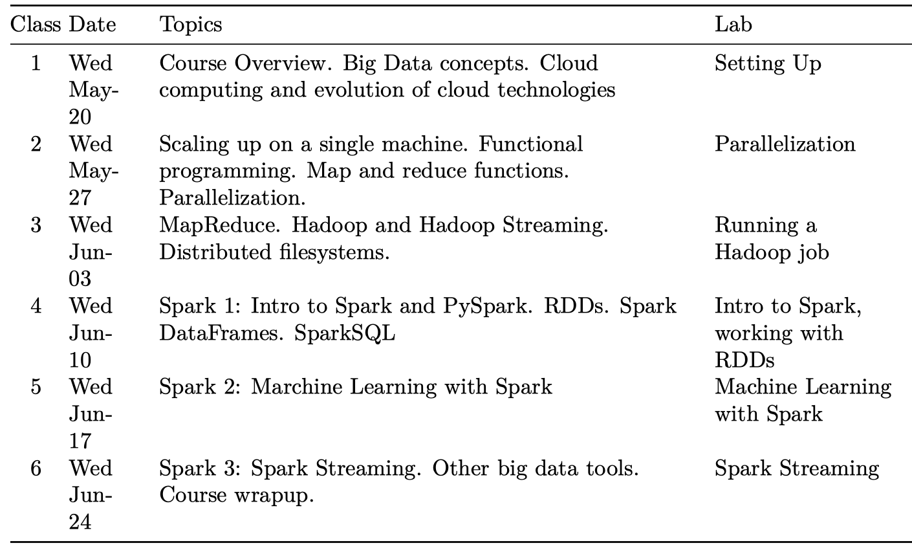

# Big-Data-Analytics

### Learning Objectives

#### • Operate big data tools and cloud infrastructure, including Spark, MapReduce, Hadoop

#### • Use ancillary tools that support big data processing, including git and the Linux command line

#### • Setup and manage big data infrastructure and tools in the cloud on Amazon Web Services and Microsoft Azure

#### • Identify broad spectrum resources and documentation to remain current with big data tools and developments

#### • Execute a big data analytics exercise from start to finish: ingest, wrangle, clean, analyze and store

